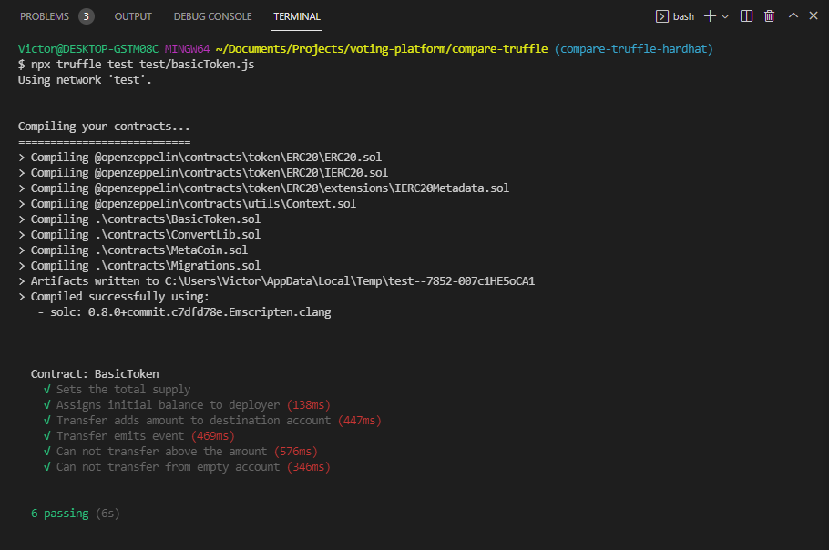
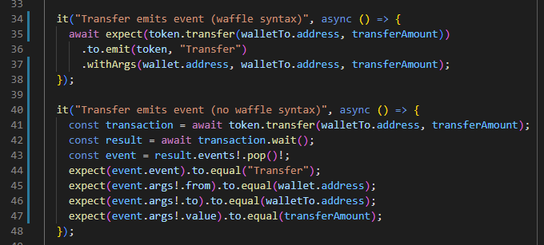
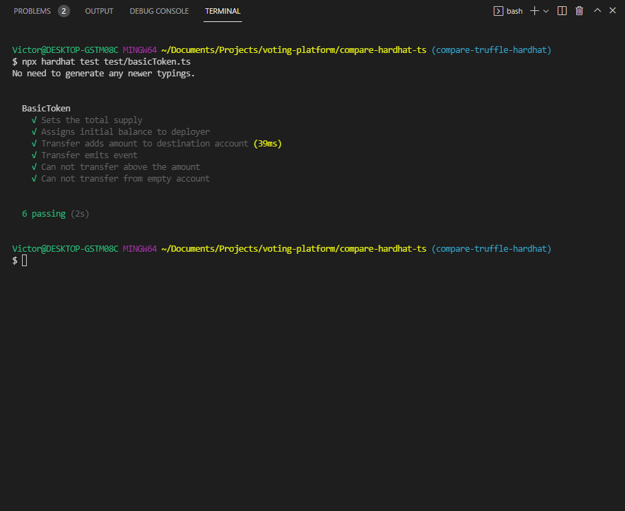
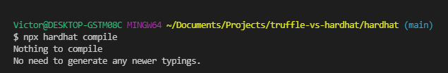

<div id="top"></div>

<!-- PROJECT LOGO -->
<br />
<div align="center">
  <h3 align="center">Truffle VS Hardhat</h3>
  <p align="center">
  This projects aims to compare the <a href="https://trufflesuite.com/">Truffle Framework</a> and the <a href="https://trufflesuite.com/">Hardhat Framework</a> when it comes to smart contracts development. A big focus is put on developer experience. The smart contract used for the purpose of this comparison is a simple ERC20 token.
  </p>
</div>

- [Truffle VS Hardhat](#truffle-vs-hardhat)
  - [Truffle](#truffle)
    - [Details](#details)
    - [Release date](#release-date)
    - [Getting started](#getting-started)
    - [Typical Project Structure](#typical-project-structure)
    - [Writing smart contracts](#writing-smart-contracts)
    - [Compilation](#compilation)
    - [Testing](#testing)
      - [Remarks](#remarks)
    - [Deploying](#deploying)
  - [Hardhat](#hardhat)
    - [Details](#details-1)
    - [Release date](#release-date-1)
    - [Getting started](#getting-started-1)
    - [Typical Project Structure](#typical-project-structure-1)
    - [Writing smart contracts](#writing-smart-contracts-1)
    - [Compilation](#compilation-1)
    - [Testing](#testing-1)
    - [Deploying](#deploying-1)

# Truffle VS Hardhat

[Truffle](https://trufflesuite.com/) and [Hardhat](https://hardhat.org/) both are smart contracts development frameworks.

---

## Truffle

### Details

Truffle is part of the Truffle Suite, a suite of four tools designed to help blockchain developers build, test and deploy dapps.

- [Truffle](https://trufflesuite.com/docs/truffle/): the smart contract development framework
- [Ganache](https://trufflesuite.com/docs/ganache/): local blockchain that runs on your PC (available as a UI or CLI)
- [Drizzle](https://trufflesuite.com/docs/drizzle/): frontend library based on redux
- Teams: (TODO: explain and link.. can't seem to find it though...)

### Release date

Truffle was founded in [2015](https://www.linkedin.com/company/trufflesuite/).

### Getting started

The approach they recommend in their [installation guide](https://trufflesuite.com/docs/truffle/quickstart.html#installing-truffle) is to install truffle globally using npm:

```sh
npm install -g truffle
```

Then, you can use the truffle CLI to [initialize a project](https://trufflesuite.com/docs/truffle/quickstart.html#creating-a-project).

### Typical Project Structure

    .
    ├── build/contracts/    # Default location for the compiled smart contracts
    ├── contracts/          # Smart contracts files (.sol)
    ├── migrations/         # Migrations scripts (what is used to deploy the contracts)
    ├── test/               # Tests for the smart contracts (javascript files)
    ├── truffle-config.js   # Configuration
    └── package.json        # No explanations needed

### Writing smart contracts

Smart contracts are written in the [solidity language](https://docs.soliditylang.org/en/v0.8.11/), (.sol files) in the `contracts` directory.

### Compilation

**Command:**

```sh
npx truffle compile
```

By default, the compiled contracts will be placed in the `build/contracts` directory.

### Testing

**Command:**

```sh
npx truffle test
```

Tests can be written in the `test` directory. Those tests can be written in javascript as well as in solidity.

#### Remarks

At least on my setup, tests take a while to run. About 250ms to 1000ms per test.



**TypeScript** is supported, but [documentation](https://trufflesuite.com/docs/truffle/testing/writing-tests-in-javascript.html#typescript-file-support) on the subject is not extensive.

As of my experimentation, contracts are recompiled before EVERY tests run. This takes some time and makes the developer experience less than optimal.

Tests written in JavaScript in a Truffle project extend the [mocha](https://mochajs.org/) testing framework with special [utilities](https://trufflesuite.com/docs/truffle/testing/writing-tests-in-javascript.html#use-contract-instead-of-describe).

### Deploying

**Command:**

```sh
npx truffle migrate
```

To deploy smart contracts, migration scripts must be written in the `migrations` directory.

In migrations scripts, use artifacts.require() to retrieve the compiled smart contracts. Ex:

```javascript
const MyContract = artifacts.require("MyContract");
```

See [documentation](https://trufflesuite.com/docs/truffle/getting-started/running-migrations.html#running-migrations) for more info.

---

## Hardhat

### Details

Hardhat is a newer smart contracts development framework. It focuses on providing a great developer experience through best practices and native support for TypeScript, along with exclusive features like the ability to write console.log statements in smart contracts.

Hardhat also has an emphasis on speed through its much faster feedback loop

### Release date

2020

### Getting started

Hardhat advocates using a local installation of the package to prevent potential version conflicts that occur as tools evolve and update.

Therefore, the recommended approach to start a project is to first create an empty directory and install Hardhat locally using the following command:

```sh
npm install --save-dev hardhat
```

Then, initialize the project by running the following command:

```sh
npx hardhat
```

Hardhat will then suggest a few installation options but I would recommended going with the _Create an advanced sample project that uses TypeScript_ option. The project is not that complicated and all the configs are already perfectly setup to start building smart contracts and testing them using TypeScript.

For further information on the installation process, make sure to check the [documentation](https://hardhat.org/getting-started/#quick-start).

The thing to remember is that the installation process is smooth and advocates using best practices to improve maintainability.

### Typical Project Structure

    .
    ├── artifacts/          # Default location for the compiled smart contracts
    ├── contracts/          # Smart contracts files (.sol)
    ├── scripts/            # User scripts
    ├── test/               # Tests for the smart contracts (javascript files)
    ├── typechain/          # Directory containing the generated TS types for our smart contracts
    ├── .env                # Environment variables (mostly used in hardhat.config.ts)
    ├── .eslintrc.js        # Linting rules
    ├── .gitignore          # Specifies files that should not be tracked by Git
    ├── .npmignore          # Specifies files that should not be included in our NPM package (if we would ever publish it)
    ├── .prettierignore     # Specifies files that our code formatter (Prettier) should ignore
    ├── .solhint.json       # Solhint configuration (linter for smart contracts)
    ├── .solhintignore      # Specifies files that should not be linted by solhint
    ├── hardhat.config.ts   # Hardhat Configuration
    ├── package.json        # NPM project file detailing dependencies and other information
    └── tsconfig.json       # TypeScript Configuration

### Writing smart contracts

Just like Truffle, smart contracts built using Hardhat are written using the Solidity language.

### Compilation

**Command:**

```sh
npx hardhat compile
```

### Testing

**Command:**

```sh
npx hardhat compile
```

Testing is done in TypeScript files in the `test` directory. Traditional mocha is used as the testing framework, although the [Waffle](https://getwaffle.io/) package which provides blockchain specific [Chai](https://www.chaijs.com/) matchers is highly recommended as a complement. Here's an example of a test using Waffle and the same test without Waffle:


According to my experimentation, tests run very quickly! ⚡

Moreover, smart contracts will only be recompiled if there were any changes since the last compilation. (Unlike what I've seen with Truffle)


Calling methods on our contracts is a breeze, thanks to [Typechain](https://github.com/dethcrypto/TypeChain) which automatically generates TS types.

### Deploying

Deploying smart contracts using Hardhat is done through user scripts (most often written in the `scripts` directory).

The command to run a user script is:

```sh
npx hardhat run scripts/scriptName.ts
```
